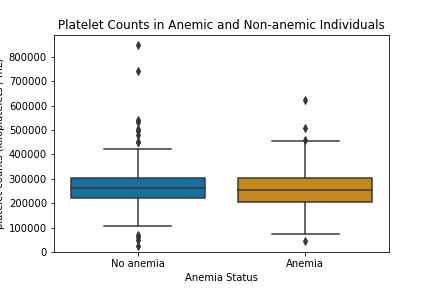
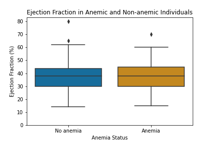
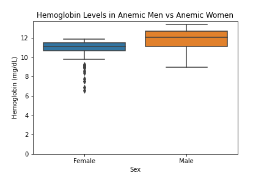
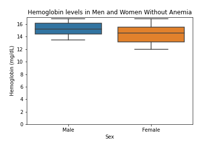

# Anemia EDA

## Overview
Here I will be examining two differnt datasets with respect to what they can tell us about anemia.

Firstly, there are several different types of anemia, but I will be using the most broad definition of a hemoglobin deficiency. Hemoglobin is the ocmponent in red blood cells that carries oxygen throughout the body.

After reviewing the datasets, here are the main question I wanted to answer.

The first dataaset wil be covering the following questions.

1. Do people with anemia have abnormal platelet counts?
2. Do people with anemia have an abnormal ejection fraction?

1. Do men with anemia have different hemoglobin levels than women with anemia?
2. If the answer to question one seems to be yes, this could simply be because men and women naturally ave differnt hemoglobin levels. Do men and women naturally have different hemoglobin levels when anemia isn't present?

## Dataset 1

With a total of only 299 total subjects, the results I get from these should be taken with a handfull of salt, their main use is to see if any of these questins may warrant further research.

### Question 1: Do people with anemia have abnormal platelet counts?

Plateets are a common cell type that are produced alongside red and white blood cels in the bone marrow. I think it's possible that lowered platelet counts could be a lesser known side-effect / symptom of anemia.

Mean platelet counts (kiloplatelets / mL) for patients with anemia: 258450 

Mean platelet counts (kiloplatelets / mL) for patients without anemia: 267082

H0: Platelet counts in people who have anemia are no different than the average person.

H1: Platelet counts in people who have anemia are, on average, lower than the average person.

P-VALUE: 0.05

Let's get a better look at the data

After a t-test, I had a p-value of 0.45, so I can't reject H0.

### Question 2: Do people with anemia have an abnormal ejection fraction?

Ejection Fractino is the percentage of blood that your heart will pump into the rest of your body each time it contracts. I think it oculd be possible that people with anemia may have higher ejection fractions, as their heart may haved to work harder in order fr them to get proper oxygen.

H0: The ejection fraction of anemic patients and non-anemic patients is no different.

H1: The ejection fraction of anemic patients is lower than that of non-anemic patients.

P-VALUE: 0.05

Mean ejection fraction (%) for patients with anemia: 38.51 

Mean  ejection fraction (%) for patients without anemia: 37.76

Here is the graph of the data again.

After a t-test, I got a p-value of about 0.59, which is far too high to reject the null hypothesis.

## Dataset 2

The second dataset is much more comprehensive, containing 1421 unique subjects. This will be used to answer the following questions.

### Question 1: Do men with anemia have different hemoglobin levels than women with anemia?

I'm curious to see how anemia might affect men and women differently, so I wanted to see if one of the groups had lower levels of hemoglobin.

H0: There is no difference between hemoglobin levels in mean and women with anemia.

H1: Men with anemia have a higher average hemoglobin level than women with anemia.

P-VALUE: 0.05

A t-test gave me a p-value of about 9.3e-36, or a decimal with 36 zeroes at the beginning. A p-value that small means I can reject the null hypothesis, it loks like men with anemia have higher hemoglobin levels on average than women with anemia.

### Question 2: Do men and women naturally have different hemoglobin levels when anemia isn't present?

It's possible that this difference could simply be due to naturally differing hemoglobin levels in men and women, so it would be wise to see if men and women have different hemoglobin levels when anemia isn't a factor.

H0: There is no difference between hemoglobin levels in mean and women without anemia.¶

H1: Men without anemia have a higher average hemoglobin level than women without anemia.

P-VALUE: 0.05

A t-test gave me a p-value of 2.7e-18, far below the 00.05 threshold, meaning I can confidently reject the null hypothesis.

Anemia affecting men and women differently, is not mutually exclusive from them having naturally different levels. While I can't prove that the diffrence in men and women with anemia has nothing to do with seeing different effects, I can confidently determine that if that is indeed the case, it is not the only factor.

## Conclusions

In short, none of my hypotheses about altered ejection fractions or platelet counts in people with anemia held much water, but that's what hypothesis testing is for.

I was able to determine that men and women naturally have difering levels of hemoglobin regardless of wether anemia is present or not, meaning differing effects on hemoglobin count between sexes, if it exists, is likely minimal.